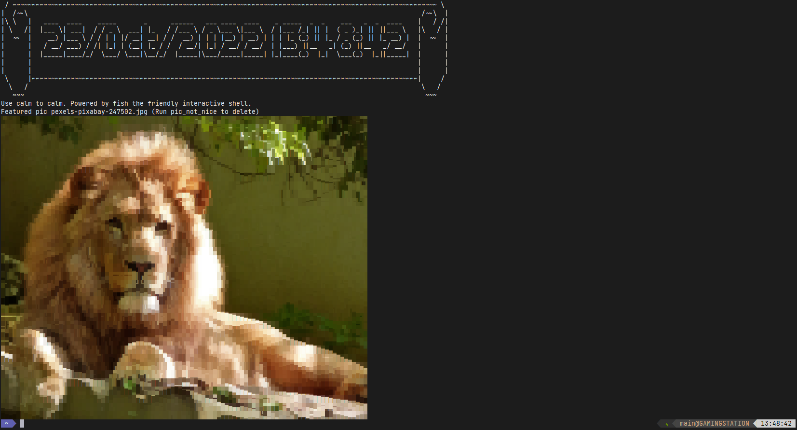

# The definitive configuration for Fish - tdcff

## fish_greeting



Image: https://www.pexels.com/photo/close-up-portrait-of-lion-247502/

Font: `Jetbrains Nerd Font Mono`

## Tweaked Commands
* `fish_greeting` - See image above.
* `calm` - Displays a single random image from the configured folders.
  Skipped if no folders are configured or no images are found.
* `pic_not_nice` - Deletes the last image displayed by `fish_greeting` or `calm`.
* `yay` - Includes the `--sudoloop` option by default.
* `update` - Custom update script. Primarily focused on arch but some other distros are also partially supported.
  * Updates the system with `yay`.
  * Updates rust with `rustup`.
  * Updates programs installed with `cargo install`.
  * Updates fisher.
* `codeup` - Updates VsCode/VsCodeInsiders on Arch.
* `ls` - Aliased to `eza`.
* `la` - Aliased to `eza -a`.
* `tree` - Aliased to `eza --tree`.
* `fish_prompt` - Changed to [tide](https://github.com/IlanCosman/tide).
## Prefixed Commands
* `tdc_btrfs_convert` - Converts a file/folder to a btrfs subvolume/file with or without CoW.
* `tdc_file_fix_future_dates` - Fixes future dates in files and sets them to the current date.
* `tdc_hello_world` - Prints "Hello, World!".
* `tdc_monitor_memory_usage` - Monitors memory usage of a process given its pid.
* `tdc_setup_deps` - Installs/Reinstalls dependencies for tdcff.
* `tdc_snapper_delete_all_snapshots_for_config` - Deletes all snapshots for a given snapper config.

## Setup

* Configure a nerd font for your terminal emulator
* Install the dependencies tdc needs. See `tdcff_functions/setup_deps.fish` file.
* `mv ~/.config/fish ~/.config/fish.bak`
* `git -C ~/.config clone https://github.com/raldone01/config_fish.git fish`
* `cd ~/.config/fish`
* `cp machine-config.fish.example machine-config.fish`
* `$EDITOR machine-config.fish`
* `fish`
* `update`

## Notes on BTRFS optimizations

```fish
# The following are common folders you may want to convert to no CoW folders on your linux system.
# In general database folders/files should be converted to no CoW files.
# However checksums are also disabled so be careful.

# The following are common folders you may want to convert to subvolumes on your linux system.
# This may be especially useful if you are using snapper for snapshots.
tdc_btrfs_convert --subvol=true --nocow=true  /var/cache/
tdc_btrfs_convert --subvol=true --nocow=true  /var/log/ # You may not want to rollback logs
tdc_btrfs_convert --subvol=true --nocow=true  /var/cache/binpkgs
tdc_btrfs_convert --subvol=true --nocow=true  /var/db/repos
tdc_btrfs_convert --subvol=true --nocow=true  ~/Games
tdc_btrfs_convert --subvol=true --nocow=true  ~/.steam/root/steamapps
tdc_btrfs_convert --subvol=true --nocow=true  ~/.local/share/Steam/steamapps/
tdc_btrfs_convert --subvol=true --nocow=true  ~/.local/share/baloo/
tdc_btrfs_convert --subvol=true --nocow=false ~/.cargo/
```
